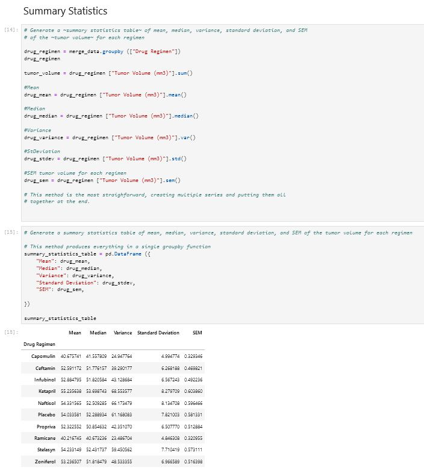
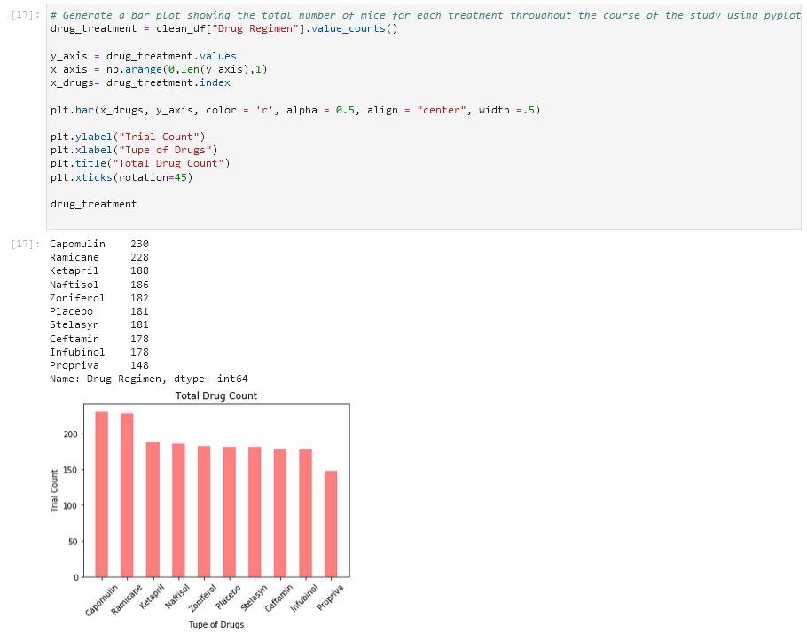
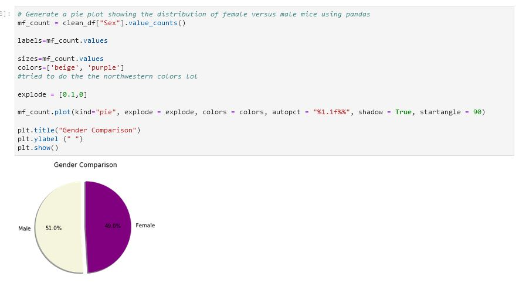
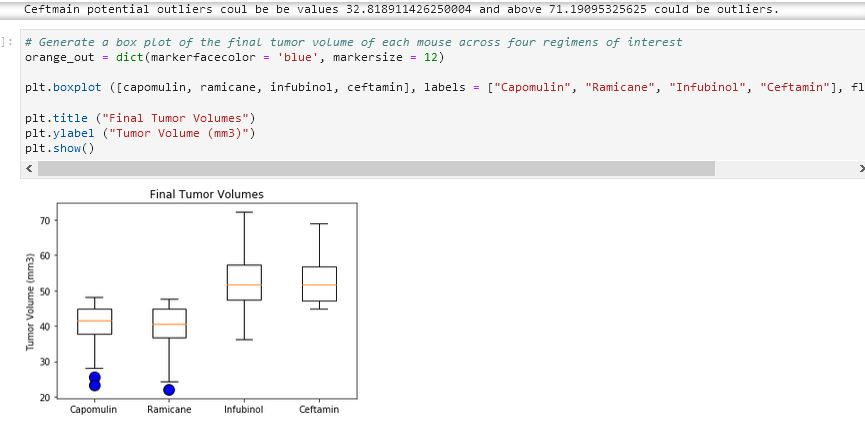
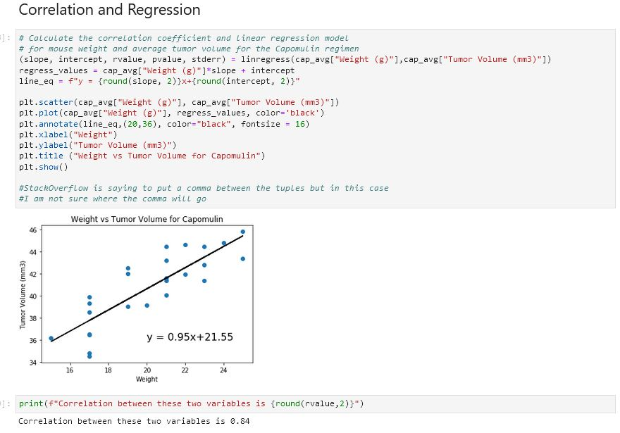

# The Power of Plots

## Purpose

Analyze a complete data set from a recent cancer study of 249 mice which have been identified with SCC (squamos cell carcinoma) that were treated with a variety of drug regimens.  Over the course of 45 days, tumor development was observed and measured.  The purpose of this study was to compare performance of Pymaceuticals' drug of interest, Capomulin, versus the other treatment regimens.  Tasks is to generate all of the tables and figures neeed for the technical report of the study.

## Process
- Clean data utlizing Pandas and Matplotlib Python libraries
- Conduct an exploratory analysis and summary statistics
- Generate summary statistics table consisting of mean, median, variance, standard deviation, and SEM of the tumor volume for each drug regimen
- Generate a bar plot using Pandas DataFrame.plot() and Matplotlib's pyplot that shows the number of total mice for each treatment regimen
  throughout the cours of the study
- Generate a pie plot using both Pandas's DataFrame.plot() and Matplotlib's pyplot that shows the distribution of female or male mice in the study
- Calculate the final tumor volume of each mouse across four of the most promising treatment regimens: Capomulin, Ramicane, Infubinol, and Ceftamin. Calculate the quartiles and IQR and quantitatively determine if there are any potential outliers across all four treatment regimens
- Using Matplotlib, generate a box and whisker plot of the final tumor volume for all four treatment regimens and highlight any potential outliers in the plot by changing their color and style
- Select a mouse that was treated with Capomulin and generate a line plot of time point versus tumor volume for that mouse
- Generate a scatter plot of mouse weight versus average tumor volume for the Capomulin treatment regimen
- Calculate the correlation coefficient and linear regression model between mouse weight and average tumor volume for the Capomulin treatment. Plot the linear regression model on top of the previous scatter plot
- Look across all previously generated figures and tables and write at least three observations or inferences that can be made from the data. Include these observations at the top of notebook

## Results and Data Observations

### Summary Statistics

### Drug Treatments

### Distribution of Gender in Study

### Box and Whisker Plot Outliers 

### Correlation Coefficient and Linear Regression Model

